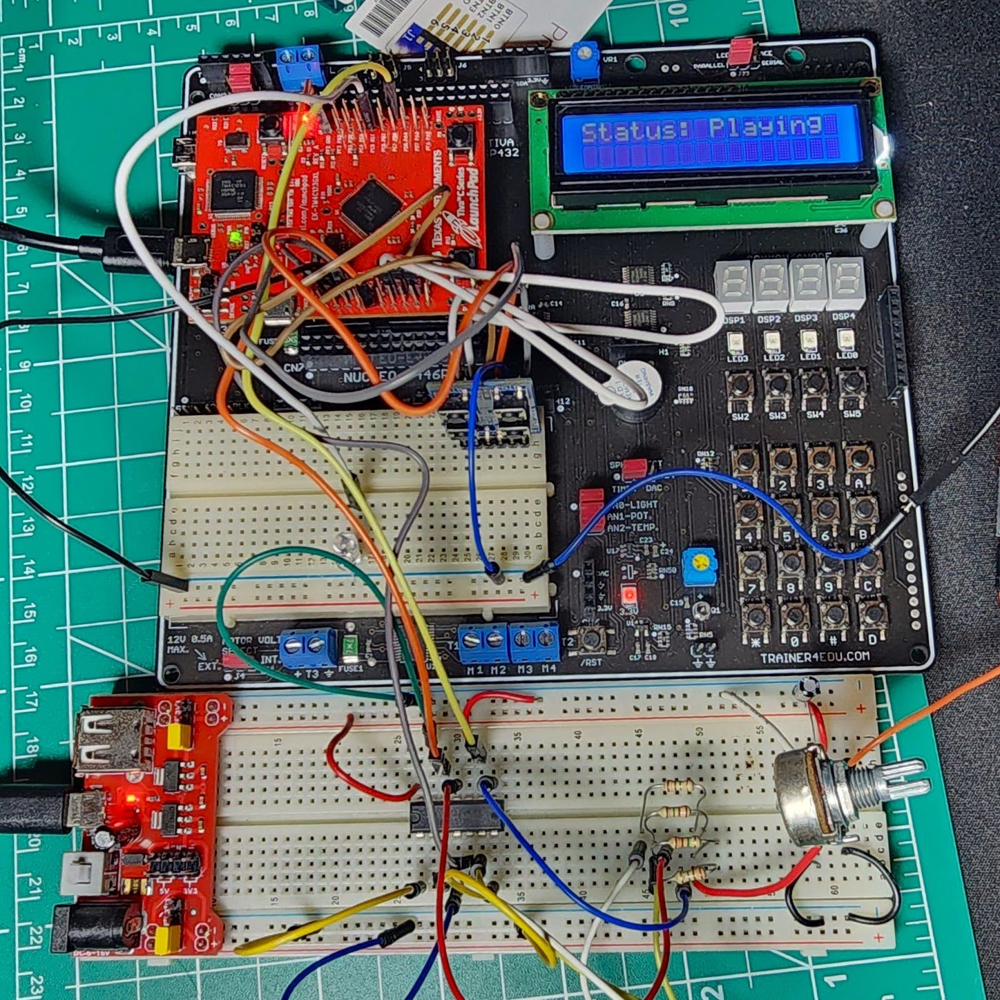
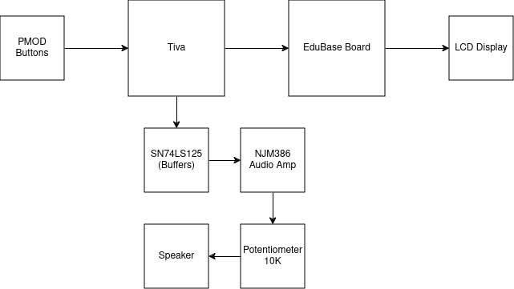

# Tiva Midi Player - ECE 425 Final Project

## Introduction
Exploring the Tiva TM4C123GH6PM microcontroller and its capabilities for PWM programming sparked the idea of creating a music box. Early labs that demonstrated musical notes played through a small buzzer evoked nostalgia, reminiscent of the soundtracks from 16-bit gaming eras. This inspired the development of a compact MIDI player capable of interpreting and playing back tracks directly from MIDI files. The primary objective was to design a self-contained device that could process MIDI input and generate audible music using PWM signals.

## Background and Methodology
This project integrates a wide array of embedded system concepts learned throughout the semester. GPIOs were configured for button inputs and LCD display outputs, while interrupts and SysTick timers managed timing and controls. To simulate layered MIDI tracks, four PWM modules were used to emulate multiple instruments simultaneously.
The General-Purpose Timer Module played a critical role in configuring PWM periods and duty cycles. Additionally, the SysTick Timer facilitated precise delays required for playback timing. MIDI files were converted into a readable .c format using  [MidiFile](https://github.com/craigsapp/midifile) enabling the microcontroller to parse and process MIDI tracks.

The setup included PMOD buttons for user input, a Quad Tri-State Buffer for routing the four PWM signals, a potentiometer for volume control, an audio amplifier for signal enhancement, and a speaker for output. An LCD display, integrated within the EduBase board, provided real-time status updates of the playback

## Block Diagram

## Components Used

| Devices | Amount Used |
| --- | ---: |
| [Tiva TM4C123GH6PM](https://www.ti.com/lit/ds/spms376e/spms376e.pdf) | x1 |
| [SN74LS125 - Quad Tri-State Buffer](https://www.ti.com/lit/gpn/SN54LS125A) | x1 |
| [NJM386 - Audio Amp](https://docs.rs-online.com/d4d0/0900766b8002dd96.pdf) | x1 |
| 10K Potentiometer | x1 |
| 4 Ohm Speaker | x1 |
| [EduBase Board](https://trainer4edu.com/edubase_v2/index.html) | x1 |
| [PMOD Buttons](https://digilent.com/reference/pmod/pmodbtn/reference-manual) | x1 |

## Pinout Used

| Pin | Utilization | Input/Output |
| --- | :---: | ---: |
| PE 1-4 | PMOD BTN 0-3 | Inputs |
| PA 2-5 | LCD D4-7 | Outputs |
| PC6 | LCD Enable | Output |
| PE0 | LCD Register Select | Output |
| PB6 | PWM0_0 | Output |
| PD0 | PWM1_0 | Output |
| PF2 | PWM1_3 | Output |
| PC5 | PWM0_3 | Output |

## Analysis and Results

The MIDI player successfully performed track playback with features such as:
•	Volume Control: Managed via a potentiometer.
•	Play/Stop Button: Controlled playback initiation and halting.
•	LCD Status Display: Displayed the current playback status.
•	LED Output: Provided a visual indicator during playback.

## MIDI Parsing and Playback:
•	MIDI files were parsed using the [MidiFile](https://github.com/craigsapp/midifile) tool, converting .mid files into a .c format for the Tiva microcontroller.
•	The MIDI tracks were split into a maximum of four channels and assigned to the four available PWM outputs.

### Examples
[Super Mario Intro](https://drive.google.com/file/d/1Ec3wyDyLBsa6OF05u46dPFqC-WILQXnV/view?usp=drive_link)

[So Fresh, So Clean - OutKast](https://youtube.com/shorts/FWsr0I1MdNg?si=zJ8ugQ_CHx7RENt3)

[Yoshi's Island Intro](https://drive.google.com/file/d/1EeKvgMTFukUXmkjqyIFN_wXHTDJ6R_ms/view?usp=drive_link)

## Limitations:
•	The system was configured for a fixed tempo of 120 BPM, restricting playback accuracy for faster tracks such as Flight of the Bumblebee.
•	Certain sound effects, like tremolos and short percussion tones, were not emulated correctly due to hardware constraints and timing complexities.
•	Breadboard connections introduced noise into the audio signal, resulting in inconsistent pitch. Various capacitor values were tested on the amplifier to optimize gain and reduce noise.

## Conclusion

 The final product successfully played tracks with up to four instrument channels at a fixed tempo of 120 BPM. While limitations such as handling variable tempos, additional instruments, the core functionality performed as intended. Hardware noise introduced pitch inconsistencies, which were mitigated through amplifier adjustments.
This project applied key embedded systems concepts like GPIO configuration, timers, interrupts, and PWM generation, offering valuable insights into microcontroller-hardware integration. It sets a solid foundation for future designs, with potential for enhancements like variable tempo playback and improved sound emulation in more advanced projects.

## Works Cited
MidiFile: https://github.com/craigsapp/midifile

Project design inspired by: https://github.com/jspicer-code/Tiva-C-MusicPlayer
